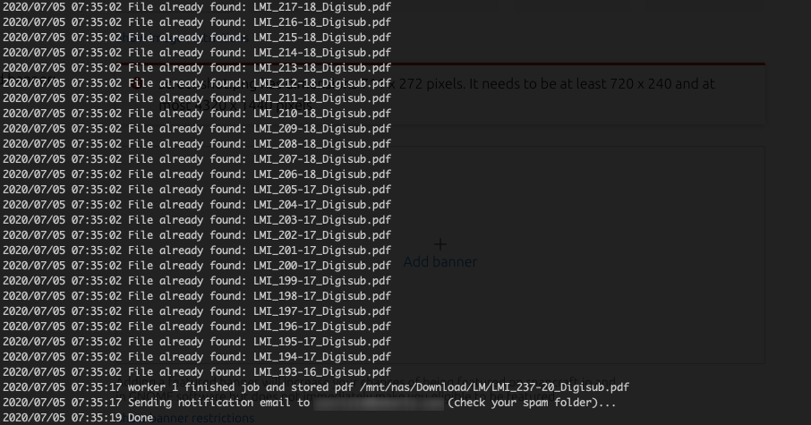

# [Linux Magazine Downloader](https://github.com/pbek/lmdownload)

[Changelog](https://github.com/pbek/lmdownload/blob/develop/CHANGELOG.md) |
[Issues](https://github.com/pbek/lmdownload/issues) |
[Releases](https://github.com/pbek/lmdownload/releases)

Linux Magazine PDF downloader for subscribers

## Installation

Beside the releases at [Releases](https://github.com/pbek/lmdownload/releases) there also is a snap `lmdownload`
in the [Snap Store](https://snapcraft.io/lmdownload) and a [docker container](https://hub.docker.com/repository/docker/pbeke/lmdownload).

You can install it by typing: `snap install lmdownload`

Afterwards you should be able to run QOwnNotes with the command `lmdownload`.

[Snaps](http://snapcraft.io/) are working on many Linux distributions like Ubuntu, Arch Linux, Debian, Fedora,
openSUSE, Gentoo Linux, OpenWRT, open embedded and yocto project.

Please note that you are only able to download PDF files to your home-directory if you are installing the snap
(unless you are breaking out of the confinement by running `/snap/lmdownload/current/lmdownload` directly).
