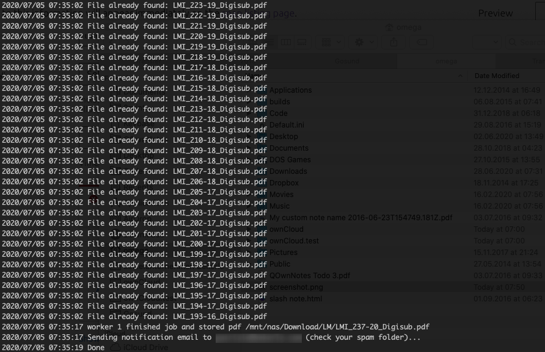

# [Linux Magazine Downloader](https://github.com/pbek/lmdownload)

[Changelog](https://github.com/pbek/lmdownload/blob/develop/CHANGELOG.md) |
[Issues](https://github.com/pbek/lmdownload/issues) |
[Releases](https://github.com/pbek/lmdownload/releases) |
[DockerHub](https://hub.docker.com/repository/docker/pbeke/lmdownload)

[](https://github.com/pbek/lmdownload/actions)
[](http://isitmaintained.com/project/pbek/lmdownload "Percentage of issues still open")

Linux Magazine PDF downloader for subscribers



## Installation

Beside the releases at [Releases](https://github.com/pbek/lmdownload/releases) there also is a snap `lmdownload`
in the [Snap Store](https://snapcraft.io/lmdownload) and a [docker container](https://hub.docker.com/repository/docker/pbeke/lmdownload).

[](https://snapcraft.io/lmdownload)

You can install it by typing: `snap install lmdownload`

Afterwards you should be able to run QOwnNotes with the command `lmdownload`.

[Snaps](http://snapcraft.io/) are working on many Linux distributions like Ubuntu, Arch Linux, Debian, Fedora,
openSUSE, Gentoo Linux, OpenWRT, open embedded and yocto project.

Please note that you are only able to download PDF files to your home-directory if you are installing the snap
(unless you are breaking out of the confinement by running `/snap/lmdownload/current/lmdownload` directly).

## Docker Compose

This is an example to run lmdownload every 12h with [Docker Compose](https://docs.docker.com/compose/): 

```yaml
version: '3.7'
services:
  # https://github.com/pbek/lmdownload
  lmdownload:
    image: pbeke/lmdownload
    restart: always
    depends_on:
      - smtp
    environment:
      - LM_USERNAME=user
      - LM_PASSWORD=pass
    volumes:
      # local folder must be owned by uid 1000!
      - /home/user/Media/Magazines/Linux-Magazine:/home/app/pdf
    entrypoint: |
      sh -c 'sh -s <<EOF
      trap "break;exit" SIGHUP SIGINT SIGTERM
      while /bin/true; do
        /bin/lmdownload -username $$LM_USERNAME -password $$LM_PASSWORD -notification-email $$LM_USERNAME -from-email noreply@example.com -smtp-host=smtp
        sleep 43200
      done
      EOF'

  # https://github.com/namshi/docker-smtp
  smtp:
    image: namshi/smtp
    restart: always
```
